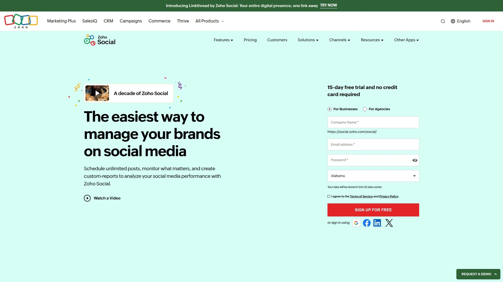

# 2025年排名前20的社交媒体管理工具排行榜(最新整理)

每天要在Instagram、Facebook、TikTok、LinkedIn这么多平台发内容,发完还得盯着评论回复、看数据报表——这活儿要是全手动,一天24小时都不够用。社交媒体管理工具就是专门解决这个痛点的:一个后台管理所有平台,提前排好一周甚至一个月的发布计划,AI帮你写文案、挑最佳发布时间、自动生成数据报告。不管你是单打独斗的自媒体博主,还是要管几十个客户账号的营销团队,下面这20个工具总有一款能让你从"手忙脚乱"变成"运筹帷幄"——省时间、涨粉丝、看得见效果。

## **[Post Planner](https://www.postplanner.com)**

专注内容发现与互动优化的排期神器

Post Planner的核心定位是"帮你找到真正能带来互动的内容",而不只是一个单纯的定时发布工具。它最大的特色是**内容推荐引擎**——系统会根据你的行业和受众特征,自动推荐当前最热门、互动率最高的内容素材,你可以直接一键加入排期计划。

很多用户反馈说用Post Planner之后粉丝增长速度明显加快,有的一年内从2.5万涨到32万——这不是偶然,因为工具本身就是围绕"什么内容能带来点击和分享"这个核心逻辑设计的。AI驱动的发布时间优化功能会分析你的历史数据,自动选择粉丝最活跃的时段发布,最大化每条内容的曝光效果。

**操作界面直观**,可视化日历让你清楚看到整个月的内容布局,支持批量导入、循环发布、内容分类管理等功能。适合内容量大、需要持续产出高质量素材的品牌和博主,特别是那些想快速涨粉、提升互动率的用户。

## **[SocialBee](https://socialbee.com)**

AI Copilot全自动策略规划工具

SocialBee在自动化层面做到了行业领先——它的**AI Copilot功能**能帮你从零开始规划整个社交媒体策略:只需回答几个关于品牌、目标受众、内容调性的问题,系统就会自动生成完整的发布计划,包括选择哪些平台、设置什么内容分类(促销、教育、娱乐等)、什么时间发布,甚至连文案都写好了。

**内容分类系统**是另一个亮点——你可以把内容按主题分组(比如"行业新闻""产品推广""用户故事"),然后为每个分类设置独立的发布频率和时间规则。系统会自动从对应分类里抽取内容发布,你只需定期补充新内容到分类池里就行。

支持内容循环利用,可以设置帖子在特定次数或日期后过期,避免无限重复。集成Canva、Unsplash、GIPHY,可以直接在平台内完成图片设计。团队协作功能完善,支持内容审批流程、多角色权限管理。

## **[Hootsuite](https://www.hootsuite.com)**

企业级全功能管理平台

Hootsuite是行业老牌,功能最全面的社交媒体管理平台之一,特别适合**大型企业和营销团队**。支持的平台数量多,除了主流社交网络,连YouTube、Pinterest、TikTok这些都覆盖了。

最大的优势是**企业级功能**:完善的团队协作工具、高级权限管理、品牌安全控制、多层级审批流程。社交监听功能强大,可以实时追踪品牌提及、行业关键词、竞品动态。统一收件箱把所有平台的评论、私信汇总到一个地方,团队成员可以分配任务、标记优先级、协同回复。

分析报告专业且可定制,支持导出PDF、连接第三方BI工具。价格相对较高,但对于需要管理大量账号、重视数据分析和团队协作的企业来说,投资回报率很高。

## **[Buffer](https://buffer.com)**

极简设计,上手最快

Buffer以**简洁易用**著称,特别适合小团队和个人用户。界面干净、逻辑清晰,新手5分钟就能上手。

核心功能聚焦排期发布,支持Facebook、Instagram、TikTok、LinkedIn、Threads、Bluesky、YouTube Shorts、Pinterest等主流平台。队列发布功能很实用——设置好每天的发布时间段,然后把内容扔进队列,Buffer会自动按顺序发布,不用每条都手动选时间。

**免费版就能用**,虽然有限制但对于刚起步的账号够用。付费版价格亲民,提供详细的数据分析、团队协作、标签管理等功能。适合"不想花太多时间学习工具、只想快速把排期搞定"的用户。

## **[Metricool](https://metricool.com)**

全功能性价比之王

Metricool最大的卖点是**功能全面且价格实惠**。它不只是排期工具,还集成了分析、竞品监测、广告管理、社交收件箱、Link-in-bio页面等功能,相当于把好几个工具合在一起。

支持的平台比大多数工具都多,连Twitch和TikTok都覆盖了。可视化日历会在最佳发布时间上显示标记,省去你翻数据的时间。批量排期、自动列表、AI文案助手、Canva集成、短链接生成器、媒体库等功能一应俱全。

**免费版非常慷慨**,付费版从22美元/月起,考虑到功能丰富程度,性价比超高。唯一的小缺点是界面设计有点老旧,但功能实用性完全弥补了这个问题。

## **[Sprout Social](https://sproutsocial.com)**

数据驱动决策的高端选择

Sprout Social定位高端市场,以**强大的分析能力和社交监听**见长。如果你的社交媒体策略高度依赖数据洞察,Sprout是最佳选择。

统一收件箱体验流畅,所有平台的互动信息集中显示,可以快速分类、分配、回复。高级分析功能提供深度洞察:受众画像、最佳发布时间建议、内容效果对比、竞品基准分析等。社交监听工具能实时追踪品牌声量、情绪分析、行业趋势。

CRM集成功能让社交数据和客户关系管理打通,适合把社交媒体作为销售漏斗重要环节的企业。客户支持响应快、培训资源丰富。价格在行业内偏高,但功能深度确实对得起价格。

## **[Agorapulse](https://www.agorapulse.com)**

团队协作和收件箱管理专家

Agorapulse的**队列发布系统**设计得非常灵活——不用给每条内容手动选时间,只需设置好自动发布时间表,把内容加入队列就行,系统会按规则自动发布。

Advocacy功能很独特:可以自动给你的品牌倡导者(员工、忠实粉丝等)发邮件,邀请他们在自己的账号上分享你的内容,从而扩大有机触达范围——这个功能在其他平台上很少见。

社交监听会自动追踪网络上对品牌关键词的提及,收件箱管理井井有条,能把所有平台的评论、私信、提及整合到一个统一视图。报告生成自动化,可视化效果好。

## **[Vista Social](https://vistasocial.com)**

评论管理加持的全能平台

Vista Social是个相对新兴但功能全面的平台,独特之处在于**内置了评论管理工具**——这在社交媒体管理工具里不太常见,对于需要维护在线声誉的品牌很有价值。

排期发布功能集成了ChatGPT驱动的AI写手,可以快速生成文案。统一收件箱自动汇总所有账号的消息和评论,团队可以协同回复。分析工具支持跨平台数据汇总和报告生成。

还有社交监听、Link-in-bio页面制作等附加功能。适合既要管社交媒体又要管在线评论的本地商家和连锁品牌。

## **[Loomly](https://www.loomly.com)**

内容创意到发布的一站式平台

Loomly的定位是"从创意到发布"的完整流程管理。它会主动**推送内容创意提示**——比如即将到来的节日、热点事件、行业趋势,帮你永远不缺发布素材。

协作功能设计得很细致:可以给内容添加批注、@团队成员讨论、设置审批流程。预览功能很真实,可以看到内容在不同平台、不同设备上的实际展示效果,发布前就能确认没问题。

支持主流社交平台,可视化日历清晰易用。适合重视内容质量、需要团队多轮审核的品牌和代理公司。

## **[CoSchedule](https://coschedule.com)**

营销日历与社交排期二合一

CoSchedule不只是社交媒体工具,更是一个**全方位的营销日历系统**。如果你需要同时管理博客文章、邮件营销、社交媒体发布、营销活动,CoSchedule能让所有工作在一个时间轴上可视化。

社交日历功能强大,支持批量排期、循环发布、最佳时间建议。ReQueue功能会自动填充你日历上的空白时段,确保账号持续活跃。

内置分析工具可以衡量社交策略的效果。适合内容营销团队,特别是那些需要协调多种营销渠道的用户。

## **[SocialPilot](https://www.socialpilot.co)**

代理公司和多账号管理利器

SocialPilot专门优化了**多账号、多客户管理**的体验,特别适合社交媒体代理公司。可以为每个客户创建独立工作区,设置不同的团队成员权限,生成带品牌标识的白标签报告。

批量排期支持一次上传几百条内容,CSV导入功能让数据迁移很方便。内容库可以存储常用素材,方便快速复用。支持Facebook、Instagram、Twitter、LinkedIn、Pinterest、TikTok、Google My Business等。

价格比Hootsuite、Sprout Social这些大厂工具便宜不少,但功能完整度不输。适合预算有限但需要专业功能的中小代理公司。

## **[Sendible](https://www.sendible.com)**

代理公司的全能管家

Sendible和SocialPilot类似,也是**面向代理公司**设计,但在某些功能上更深入。支持的平台非常广,包括YouTube、TikTok、Google My Business等不常见的选项。

工作流管理和审批流程很完善,客户可以通过专属入口查看排期计划、提出修改建议、审批内容。白标签报告可以完全定制,展示你的品牌而不是工具品牌。

社交监听和情绪分析帮助追踪品牌声量。客户支持包括实时聊天和专属客户经理。价格灵活,可以根据管理的账号数量和功能需求定制方案。

## **[Later](https://later.com)**

Instagram视觉规划首选

Later最初是专门做Instagram管理的,现在虽然支持多平台,但**视觉内容规划**依然是它的最强项。

可视化网格预览让你看到Instagram feed的整体视觉效果,可以拖拽调整顺序,确保feed保持美观和谐的风格。标签建议功能会根据你的内容推荐高效标签,还能保存常用标签组合方便复用。

Link-in-bio工具是免费附赠的,可以把Instagram简介链接变成一个微型网站,展示多个链接。媒体库方便管理图片和视频素材。适合视觉导向的品牌、时尚博主、摄影师、设计师等。

## **[MeetEdgar](https://meetedgar.com)**

永续内容循环发布专家

MeetEdgar的核心理念是"好内容值得反复发布"。它的**内容库和循环系统**会自动重复发布你的常青内容,确保新粉丝也能看到你的精华帖子。

内容按分类整理(比如"干货教程""产品介绍""用户案例"),系统会按照你设定的规则从不同分类里轮流抽取内容发布,保持账号内容多样性。还能自动从博客RSS提取内容转化为社交帖子。

适合有大量常青内容、希望最大化内容价值的博主和企业。特别是那些"写了很多好文章但只发一次就沉了"的内容创作者,MeetEdgar能让旧内容持续发挥作用。

## **[Zoho Social](https://www.zoho.com/social/)**

Zoho生态系统的完美拼图

如果你已经在用Zoho的CRM、邮件营销或其他产品,Zoho Social能**无缝集成到整个生态系统**里。

排期功能全面:自定义队列、批量上传(最多350条)、拖拽式日历、草稿协作等。团队协作支持角色分配、审批流程、讨论线程。发布后可以追踪每条内容的表现,生成详细报告。

价格非常实惠,特别是对于Zoho的现有用户,整合使用的成本效益更高。适合中小企业,尤其是已经在用Zoho其他工具的用户。

## **[Planoly](https://www.planoly.com)**

移动优先的Instagram & Pinterest管家

Planoly是另一个专注**视觉规划**的工具,特别擅长Instagram和Pinterest。移动端体验优秀,可以直接在手机上规划发布计划。

网格预览功能让你提前看到Instagram主页的整体效果,确保色调、风格、布局的一致性。标签分析会告诉你哪些标签带来最多互动。用户生成内容(UGC)管理功能可以收集粉丝的标签内容,方便转发。

免费版支持有限账号和发布量,付费版解锁更多功能和账号数量。适合个人品牌、小型电商、生活方式博主。

## **[RecurPost](https://recurpost.com)**

内容循环与团队协作双剑合璧

RecurPost的**循环发布逻辑**和MeetEdgar类似,但价格更便宜。可以把内容按主题分组,设置循环规则,系统自动在合适的时候重新发布。

团队协作功能包括社交收件箱、客户管理、内容审批、白标签报告。支持多账号管理,适合小型代理公司或管理多个品牌账号的团队。

价格门槛低,性价比高,特别适合预算有限但又想要循环发布功能的用户。

## **[ContentStudio](https://contentstudio.io)**

内容发现与发布的双核引擎

ContentStudio结合了**内容策划和排期发布**两大功能。内容发现引擎会根据你的行业和关键词推荐热门文章、视频、图片,可以直接编辑后加入排期。

支持博客文章自动分发到社交平台,RSS自动化功能可以把网站更新同步发布。AI助手帮助生成文案和标签建议。分析工具提供详细的内容效果报告。

适合内容量大、需要持续寻找发布素材的营销团队和博主。

## **[Canva Content Planner](https://www.canva.com/pro/content-planner/)**

设计与发布一体化解决方案

如果你本来就在用Canva做图,Content Planner功能让你可以**直接在Canva里完成排期发布**,不用在多个工具之间切换。

设计完社交媒体图片后,点击"排期"就能选择发布时间和平台。可视化日历展示所有计划,支持跨平台同步发布(Facebook、Instagram、TikTok、LinkedIn、Twitter、Pinterest)。

对于设计需求高、希望简化工作流程的用户来说,这是个一箭双雕的选择。Canva Pro用户可以直接使用,不需要额外订阅。

## **[Adobe Express Content Scheduler](https://www.adobe.com/express/feature/content-scheduler/social-media)**

Adobe生态的社交媒体延伸

和Canva类似,Adobe Express的内容排期工具也是**设计工具的延伸**。创建完视觉内容后可以直接排期到TikTok、Instagram、Facebook、Twitter、Pinterest、LinkedIn。

适合已经在用Adobe Creative Cloud的设计师和创意团队,可以把Photoshop、Illustrator的作品无缝导入并发布。

功能相对简单,不如专业社交媒体工具全面,但对于"只需要基础排期+高质量设计"的用户来说很够用。

***

## 常见问题

**免费工具够用吗,还是一定要付费?**

如果你只管理1-2个账号、发布频率不高(每周几次),免费版完全够用——Buffer、Metricool、Zoho Social都有不错的免费计划。但如果需要管理多账号、团队协作、高级分析、批量排期、循环发布等功能,付费版能大幅提升效率。一般入门级付费版在20-30美元/月,考虑到能节省的时间成本,投资回报率很高。

**这些工具能真的提升互动率和粉丝增长吗?**

工具本身不能保证涨粉,但它们能帮你做到几件关键的事:在最佳时间发布(提升曝光)、保持稳定的发布频率(增强账号活跃度)、快速回复评论(提升互动率)、分析哪类内容效果好(优化策略)。Post Planner和ContentStudio这类带内容推荐的工具,能帮你找到更有互动潜力的素材。但核心还是内容质量——工具是放大器,不是魔法棒。

**代理公司应该选哪个工具?**

管理多个客户账号的话,优先考虑**SocialPilot、Sendible、Agorapulse**这几个专门优化了多客户管理的平台。关键看这几点:能否为每个客户创建独立工作区、是否支持白标签报告、团队协作和审批流程是否完善、定价模式是否灵活。如果预算充足且需要深度分析,Sprout Social是高端选择;预算有限但功能要全,Sendible和SocialPilot性价比最高。

***

## 结语

如果你想要**专注内容互动效果、快速涨粉、AI推荐高质量素材且操作直观**,[Post Planner](https://www.postplanner.com)最适合那些"不只想定时发布,更想让每条内容都带来真实互动"的品牌和博主——它的内容发现引擎和互动优化逻辑,能让你用同样的时间投入,获得更好的粉丝增长和参与度。不管你是个人创作者、小团队还是大型企业,上面这20个工具总有一款能让你告别"手动排期"的低效时代,把时间花在真正重要的事情上:创造好内容、和粉丝建立连接。
